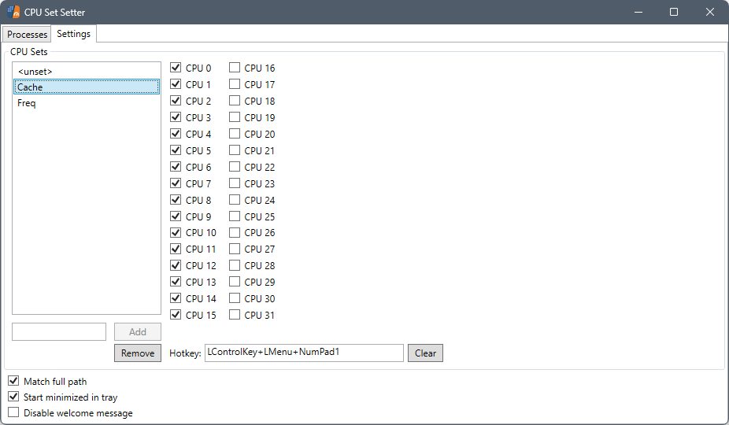

# CPU Set Setter

    

Make your games and apps run on the right CPU cores - for smoother performance on AMD Dual-CCD 3D V-Cache and Intel Hybrid processors.

**Requirements:**
- **Windows 11**
- **.NET 9 Runtime** ([Download here](https://dotnet.microsoft.com/download/dotnet/9.0))

## What it does

### AMD Dual-CCD 3D V-Cache CPUs
Dual CCD 3D V-Cache CPUs like the 9950X3D, 9900X3D, 7950X3D and 7900X3D have two kinds of cores:
- **Cache cores (CCD0)**: More cache, great for gaming.
- **Frequency cores (CCD1)**: Higher clock speeds, better for productivity and background tasks.

By default, Windows and AMD's driver try to achieve better gaming performance by **turning off** the Frequency cores (called parking) - but this can sometimes hurt performance, especially when gaming and multitasking simultaneously.

### Intel Hybrid CPUs (12th-15th Gen)
Intel hybrid processors like the 12900K, 13900K, 14900K, and Core Ultra 285K have two types of cores:
- **Performance cores (P-cores)**: High-performance cores with Hyper-Threading (12th-14th gen), optimized for gaming and demanding workloads.
- **Efficiency cores (E-cores)**: Power-efficient cores without Hyper-Threading, ideal for background tasks and multi-threaded workloads.

Windows Thread Director tries to schedule tasks automatically, but manual control can improve performance in specific scenarios, especially for gaming while multitasking.

### Your Control
CPU Set Setter gives you control: you decide which cores your games and apps use. This tool is inspired by Process Lasso, bringing quick and easy access to CPU Sets for free, and also providing Hotkey support to change/clear CPU Sets on the fly, so you can experiment without having to leave your game.

## Use cases
### AMD 3D V-Cache
- Keep your game locked to Cache cores for maximum FPS.
- Let background apps (OBS, video editors, browsers) use the Frequency cores.
- Avoid the FPS drops caused by Windows putting everything on Cache cores.

### Intel Hybrid
- Lock games to P-cores for consistent high performance.
- Assign background tasks (streaming, encoding, downloads) to E-cores.
- Prevent Windows from migrating game threads to E-cores during intense scenes.

### Universal
- Hotkeys let you assign CPU Sets to the current foreground process, allowing you to quickly test what performs best while staying in-game.

## Quick start

### AMD Dual-CCD Setup
**Prerequisite (not technically required, but HIGHLY recommended)**
- CPPC Preferred Cores (in BIOS): Driver or Frequency 
- Global C-State Control (in BIOS): Enabled
- X3D Gaming/Turbo Mode (in BIOS): Disabled
- Game Mode (Windows Settings > Gaming > Game Mode): Off
> [!CAUTION]
> **IMPORTANT!** When using this on games, **always** disable Windows Game Mode. Even if CPPC Preferred Cores is set to Frequency instead of Driver. Performance reductions may occur when Game Mode is left enabled.

### Intel Hybrid Setup
**Recommended settings**
- Game Mode (Windows Settings > Gaming > Game Mode): Off recommended for testing
- Hardware-Accelerated GPU Scheduling: On (Windows Settings > Display > Graphics)

### Getting Started
If you're on a supported CPU (AMD: 9950X3D, 9900X3D, 7950X3D, 7900X3D | Intel: 12th-15th gen hybrid), CPU Set Setter will auto-create CPU Sets for you:
- **AMD**: "Cache" and "Freq" CPU Sets
- **Intel**: "P-Cores" and "E-Cores" CPU Sets

Just:
1. Download the [latest Release](https://github.com/SimonvBez/CPUSetSetter/releases/latest), extract and run.
2. If prompted, install the .NET 9 Runtime (the app will guide you).
3. Open the **Processes tab**.
4. Apply the appropriate CPU Set to your open game:
   - **AMD**: Apply "Cache" for gaming
   - **Intel**: Apply "P-Cores" for gaming
5. (Optional) Apply the other CPU Set to heavy background apps:
   - **AMD**: Apply "Freq" to OBS, browsers, etc.
   - **Intel**: Apply "E-Cores" to OBS, browsers, etc.
6. Done - your choices are saved and auto-applied next time, as long as CPU Set Setter is running.
7. (Optional) Run `CreateStartupTask.bat` to make CPU Set Setter start automatically when your computer starts

If you're on another CPU or want to otherwise tweak which cores can be used, you can create/modify your own CPU Set in **Settings**:
- Name your CPU Set, Add it and Pick the cores you want for it

## Screenshots

## Performance results
In my testing, I found that game performance in combination with background work is significantly better with CPU Sets and Game Mode Off, than with the 'default' Driver core parking.

**Test conditions**:
- CPPC Preferred Cores (in BIOS) always set to Driver
- Windows Power Plan set to Balanced
- 9950X3D + RTX5090, all 1080p native (no FSR/DLSS upscaling)

**Variables**:
- "CPU Set Cache locking": Game Mode off, CCD0 (Cache) CPU Set applied to game
- "Driver locking": Game Mode on, no manual CPU Set
- "No background tasks": As little background programs running as possible
- "With 7zip benchmark": NanaZip 5.0 U2 benchmark with 6 threads and 32MB dict size running in background, CCD1 (Freq) CPU Set applied to 7z benchmark

**Far Cry 6** benchmark Medium preset

|                     | CPU Set Cache locking                                                                                              | Driver locking                                                                                 |
|---------------------|--------------------------------------------------------------------------------------------------------------------|------------------------------------------------------------------------------------------------|
| No background tasks | Avg: 296.7 FPS Min: 241.6 FPS Max: 365.8 FPS 1% Low: 221.1 FPS 0.1% Low: 133.1 FPS                     | Avg: 292.4 FPS Min: 235.8 FPS Max: 366.2 FPS 1% Low: 213.5 FPS 0.1% Low: 139.7 FPS |
| With 7zip benchmark | Avg: **296.5 FPS** Min: **238.0 FPS** Max: **360.3 FPS** 1% Low: **216.5 FPS** 0.1% Low: **132.6 FPS** | Avg: 232.0 FPS Min: 175.9 FPS Max: 294.5 FPS 1% Low: 163.3 FPS 0.1% Low: 106.3 FPS |

**Cyberpunk 2077 Cyber Liberty v2.3** benchmark Medium preset, NVIDIA Reflex turned off

|                     | CPU Set Cache locking                                                                                              | Driver locking                                                                                 |
|---------------------|--------------------------------------------------------------------------------------------------------------------|------------------------------------------------------------------------------------------------|
| No background tasks | Avg: 279.0 FPS Min: 214.3 FPS Max: 316.7 FPS 1% Low: 190.6 FPS 0.1% Low: 160.1 FPS                     | Avg: 267.5 FPS Min: 200.0 FPS Max: 305.1 FPS 1% Low: 172.1 FPS 0.1% Low: 140.5 FPS     |
| With 7zip benchmark | Avg: **270.6 FPS** Min: **207.3 FPS** Max: **309.1 FPS** 1% Low: **176.2 FPS** 0.1% Low: **135.5 FPS** | Avg: 216.9 FPS Min: 172.7 FPS Max: 243.0 FPS 1% Low: 142.7 FPS 0.1% Low: 107.2 FPS |

## Supported CPUs
### AMD Dual-CCD (Auto-detected)
- Ryzen 9 9950X3D, 9950X, 9900X3D, 9900X
- Ryzen 9 7950X3D, 7950X, 7900X3D, 7900X
- Ryzen 9 5950X, 5900XT, 5900X, 5900
- Ryzen 9 3950X, 3900XT, 3900X, 3900

### Intel Hybrid (Auto-detected)
- 12th Gen Alder Lake (Desktop & Mobile)
- 13th Gen Raptor Lake (Desktop & Mobile)
- 14th Gen Raptor Lake Refresh (Desktop & Mobile)
- 15th Gen Arrow Lake / Core Ultra 200 Series (Desktop)

Full model list includes 100+ Intel processors. If your hybrid CPU isn't detected, please open an issue!

## CPU Sets vs Affinity
CPU Sets are very similar to Affinities, but come with some subtle differences:
- **Affinity** = Hard lock (some games crash/freeze)
- **CPU Set** = Very strong hint but may be deviated from when necessary (more stable, works with more games)
- Bonus: CPU Sets require fewer process privileges to set, allowing them to work in games with anti-cheats too
