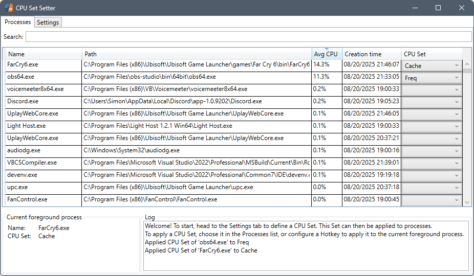
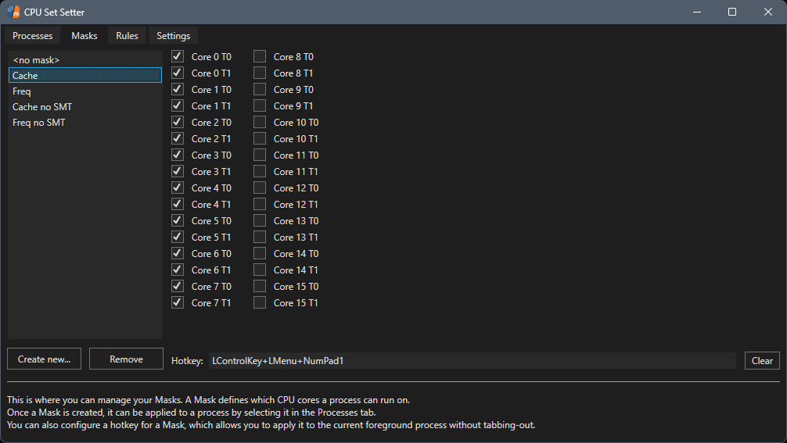
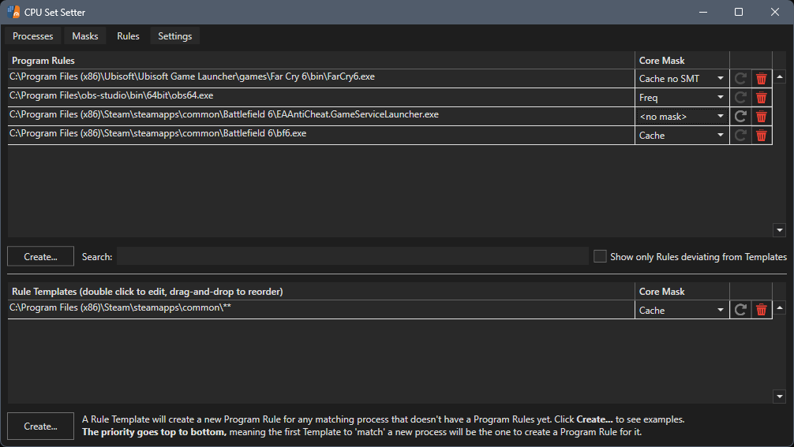

# CPU Set Setter

    

Make your games and apps run on the right CPU cores &mdash; for smoother performance on AMD Dual-CCD and Intel Hybrid processors.

**Requirements:**
- **Windows 10+**
- **.NET Desktop Runtime 10** (Follow in-app instructions)

# What it does
Windows tries its best to schedule tasks automatically, but it may often not be optimal. CPU Set Setter gives you control: you decide which cores your games and apps can use. This tool brings quick and easy access to **CPU Sets** &mdash; almost the same as Affinity, but better &mdash; for free.

# Common use cases / why you'd use this

## CCD locking; it's like parking, but better! (AMD Ryzen 9)
On dual-CCD CPUs, games can see big performance improvements when they are locked to the cores on a single CCD, especially on Ryzen 9 X3D CPUs. AMD and Windows usually accomplish this by **turning off** the other CCD (called parking), but this means background processes will now also be forced onto the same CCD as the game, leading to lower and less consistent framerates.

Ryzen 9 CPUs will see the largest benefit with CPU Set Setter! Especially when gaming and multitasking (streaming/rendering/etc) simutaniously.

## P-core locking (Intel 12th gen and up)
Windows does its best to schedule processes automatically, but manual control over which cores a game and background processes can use will improve performance in some scenarios.

## Soft-disabling SMT/HyperThreading (almost all CPUs, both Intel and AMD)
By restricting a program to only use the even (or uneven) cores you can soft-disable SMT/HT. Some games and programs (like Far Cry 6) may see an increase in performance by doing this.

This can be done in combination with the uses cases above.
 
For 5800X3D, 7800X3D and 9800X3D CPUs, this is probably the most/only useful tweak you can use.

# Experimentation is key
To quickly find out which core configuration works best for a certain game, CPU Set Setter provides Hotkey support to change/clear a program's Core Mask on the fly, so you can experiment quickly without having to even tab-out of your game.

# Setup/Installation (IMPORTANT, FOLLOW THIS)
To most optimally use CPU Set Setter, you may have to first follow some prerequisites depending on your CPU. See:
 
[AMD CPU setup](docs/setup/AMD.md)
 
[Intel CPU setup](docs/setup/Intel.md)

# Screenshots

# Featured on

 
❤️

# CPU Sets vs Affinity
But what are these CPU Sets you speak of? Aren't they just Affinities?
 
CPU Sets achieve the same results as Affinities; restricting which cores a process can use, but come with some subtle differences:
- **Affinity** = Hard lock (some games crash/freeze)
- **CPU Set** = Very strong hint but may be deviated from when necessary (more stable, works with more games)
- Bonus: CPU Sets require fewer process privileges to set, allowing them to work in games with anti-cheats too

This makes them better fit in almost every scenario.

# Donations
If you like CPU Set Setter, my goal is already fulfilled!
 
But if you like it so much that you'd like to donate to me, you now can by either becoming a [GitHub sponsor](https://github.com/sponsors/SimonvBez), or donate directly with [PayPal](https://paypal.me/SimonvBez). It'd be infinitely appreciated and will help me to maintain and expand CPU Set Setter in the future.

Doing so is completely optional, as CPU Set Setter does not and will not have any form of pay-only features, advertisements or nagging. It will always remain fully free and open-source.
